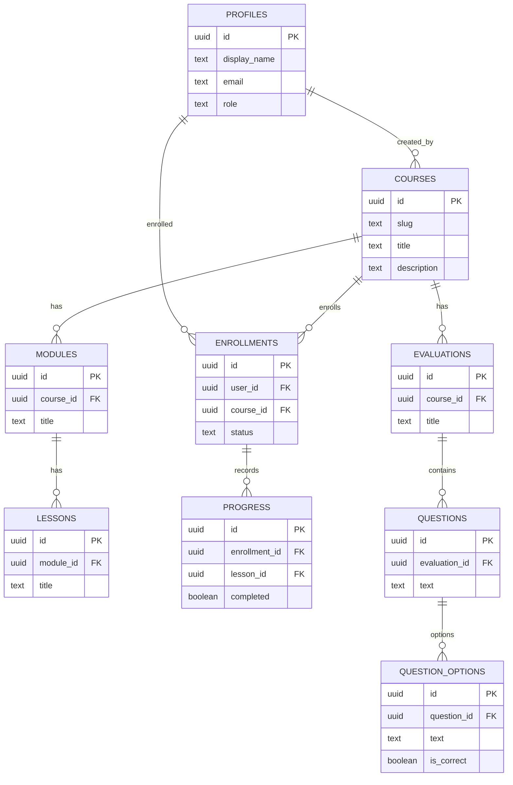

## Esquema de la base de datos (ER) — TEAM-03

Descripción: este documento resume el esquema base implementado en `db/migrations/001_init.sql` y el mapeo a requerimientos funcionales clave. No contiene políticas RLS (esas se definen en migraciones separadas).

### Diagrama ER (Mermaid)

### Mapeo a requisitos (ejemplos)
- `profiles` → FR-007, SC-005 (identidad, roles, owner). 
- `courses/modules/lessons` → FR-001, FR-002, FR-003 (contenidos y estructura de cursos).
- `enrollments` + `progress` → FR-003, FR-017 (seguimiento de progreso y contratos de sincronización).
- `evaluations/questions/question_options` → FR-010..FR-014, SC donde `is_correct` es interno (RNF-002).

### Notas importantes
- `question_options.is_correct` existe en la BD pero **no** debe exponerse al cliente; las vistas/funciones y la API deben filtrar este campo. (Ver `spec.md` y `plan.md`.)
- RLS no está habilitado en `001_init.sql`; las políticas deben añadirse en migraciones separadas y habilitarse solo tras validación en staging.
- Índices básicos incluidos (email, slug). Ajustar índices adicionales según queries reales.

---

Si quieres, puedo generar un diagrama PNG/SVG a partir del Mermaid y añadirlo al repo para documentación visual (no comiteado automáticamente). ¿Lo quieres? 
